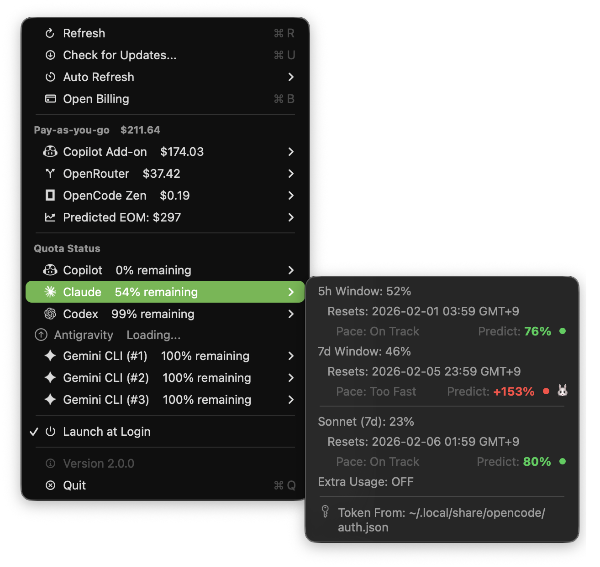

# OpenCode Bar

<p align="center">
  
  
</p>

<p align="center">
  <strong>Automatically monitor all your AI provider usage from OpenCode in real-time from the macOS menu bar.</strong>
</p>

<p align="center">
  <a href="https://github.com/kargnas/opencode-bar/releases/latest">
    
  </a>
  <a href="https://github.com/kargnas/opencode-bar/blob/main/LICENSE">
    
  </a>
  
  
</p>

---

## Overview

**OpenCode Bar** automatically detects and monitors all AI providers registered in your [OpenCode](https://opencode.ai) configuration. No manual setup required - just install and see your usage across all providers in one unified dashboard.

### Supported Providers (Auto-detected from OpenCode)

| Provider | Type | Key Metrics |
|----------|------|-------------|
| **Claude** | Quota-based | 5h/7d usage windows, Sonnet/Opus breakdown |
| **Codex** | Quota-based | Primary/Secondary quotas, plan type |
| **Gemini CLI** | Quota-based | Per-model quotas, multi-account support |
| **Kimi for Coding (Kimi K2.5)** | Quota-based | Usage limits, membership level, reset time |
| **OpenRouter** | Pay-as-you-go | Credits balance, daily/weekly/monthly cost |
| **OpenCode Zen** | Pay-as-you-go | Daily history (30 days), model breakdown |
| **Antigravity** | Pay-as-you-go | Local language server monitoring |
| **GitHub Copilot** | Quota-based | Daily history, overage tracking, EOM prediction |

## Features

### Automatic Provider Detection
- **Zero Configuration**: Reads your `~/.local/share/opencode/auth.json` automatically
- **Dynamic Updates**: New providers appear as you add them to OpenCode
- **Smart Categorization**: Pay-as-you-go vs Quota-based providers displayed separately

### Real-time Monitoring
- **Menu Bar Dashboard**: View all provider usage at a glance
- **Visual Indicators**: Color-coded progress (green → yellow → orange → red)
- **Quota Alerts**: Warning icons when remaining quota < 20%
- **Detailed Submenus**: Click any provider for in-depth metrics

### Usage History & Predictions
- **Daily Tracking**: View request counts and overage costs
- **EOM Prediction**: Estimates end-of-month totals using weighted averages
- **Add-on Cost Tracking**: Shows additional costs when exceeding limits

### Convenience
- **Auto Refresh**: Configurable intervals (10 seconds to 30 minutes)
- **Launch at Login**: Start automatically with macOS
- **Parallel Fetching**: All providers update simultaneously for speed

## Installation

### Download (Recommended)

Download the latest `.dmg` file from the [**Releases**](https://github.com/kargnas/opencode-bar/releases/latest) page.

> **Note**: If you see a "App is damaged" error, run this command in Terminal:
> ```bash
> xattr -cr "/Applications/CopilotMonitor.app"
> ```

### Build from Source

```bash
# Clone the repository
git clone https://github.com/kargnas/opencode-bar.git
cd opencode-bar

# Build and run
xcodebuild -project CopilotMonitor/CopilotMonitor.xcodeproj \
  -scheme CopilotMonitor -configuration Debug build

# Open the app
open ~/Library/Developer/Xcode/DerivedData/CopilotMonitor-*/Build/Products/Debug/*.app
```

**Requirements:**
- macOS 13.0+
- Xcode 15.0+ (for building from source)
- [OpenCode](https://opencode.ai) installed with authenticated providers

## Usage

1. **Install OpenCode**: Make sure you have OpenCode installed and authenticated with your providers
2. **Launch the app**: Run OpenCode Bar
3. **View usage**: Click the menu bar icon to see all your provider usage
4. **GitHub Copilot** (optional): Click "Sign In" to add Copilot monitoring via GitHub OAuth

### Menu Structure

```
─────────────────────────────
Pay-as-you-go
  OpenRouter       $37.42    ▸
  OpenCode Zen     $0.19     ▸
─────────────────────────────
Quota Status
  Copilot          0%        ▸
  Claude           60%       ▸
  Codex            100%      ▸
  Gemini CLI (#1)  100%      ▸
─────────────────────────────
Predicted EOM: $451
─────────────────────────────
Refresh (⌘R)
Auto Refresh              ▸
Settings                  ▸
─────────────────────────────
Version 2.0.0
Quit (⌘Q)
```

## How It Works

1. **Token Discovery**: Reads authentication tokens from OpenCode's `auth.json`
2. **Parallel Fetching**: Queries all provider APIs simultaneously
3. **Smart Caching**: Falls back to cached data on network errors
4. **Graceful Degradation**: Shows available providers even if some fail

### Privacy & Security

- **Local Only**: All data stays on your machine
- **No Third-party Servers**: Direct communication with provider APIs
- **Read-only Access**: Uses existing OpenCode tokens (no additional permissions)
- **Secure Storage**: GitHub Copilot uses OAuth session without storing passwords

## Contributing

Contributions are welcome! Please submit a Pull Request.

### Development Setup

1. Fork the Project
2. Create your Feature Branch (`git checkout -b feature/AmazingFeature`)
3. **Setup Git Hooks** (automated linting before commits):
   ```bash
   ./scripts/setup-git-hooks.sh
   ```
4. Make your Changes
5. Commit your Changes (`git commit -m 'Add some AmazingFeature'`)
   - SwiftLint will automatically check your code before commit
   - Fix any violations or use `git commit --no-verify` to bypass (not recommended)
6. Push to the Branch (`git push origin feature/AmazingFeature`)
7. Open a Pull Request

### Code Quality

This project uses SwiftLint to maintain code quality. All Swift files are automatically checked:

- **Pre-commit Hook**: Runs on `git commit` (install via `./scripts/setup-git-hooks.sh`)
- **GitHub Actions**: Runs on all pushes and pull requests
- **Manual Check**: Run `swiftlint lint CopilotMonitor/CopilotMonitor` anytime

## License

MIT License - See [LICENSE](LICENSE) file for details.

## Related

- [OpenCode](https://opencode.ai) - The AI coding assistant that powers this monitor
- [GitHub Copilot](https://github.com/features/copilot)

---

<p align="center">
  Made with tiredness for AI power users
</p>
